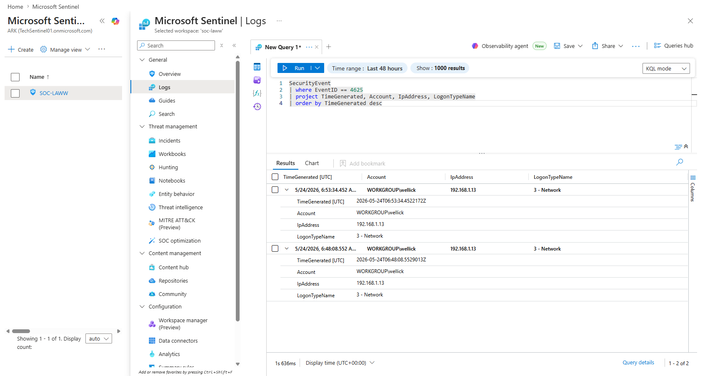
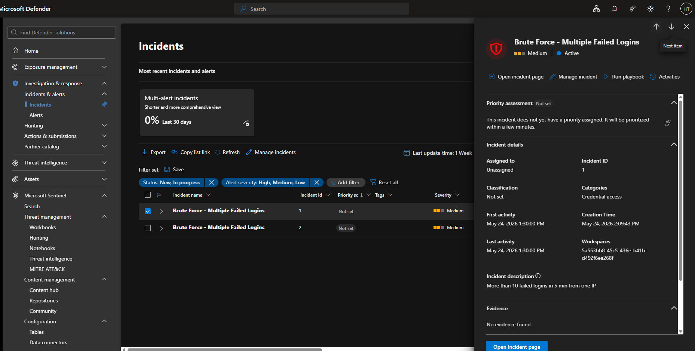

# Brute Force Login Attempt
**Date:** 2026-05-24
**Severity:** Medium
**Status:** Resolved (Lab)

## What Happened
A brute force attack was simulated from a Kali Linux VM using Hydra 
targeting the SMB service on the Windows victim machine. Multiple 
failed login attempts were generated against the wellick account.

## How It Was Detected
Sentinel Analytics Rule fired after detecting more than 10 failed 
logins (Event ID 4625) from the same source IP within 5 minutes.

## Attack Details
| Field | Value |
|-------|-------|
| MITRE Technique | T1110.001 |
| Tactic | Credential Access |
| Tool Used | Hydra |
| Source | Kali VM  |
| Target Account | wellick |
| Target Host | Windows VM |

## Evidence

## What I Learned
Aggregating failed logins by source IP and time window is more 
effective than alerting on every single failure — reduces noise 
significantly.

## Recommended Response
1. Isolate the affected machine immediately
2. Reset credentials for targeted account
3. Check for any successful logins from same IP
4. Enforce account lockout policy after 5 failures
5. Block source IP at firewall level