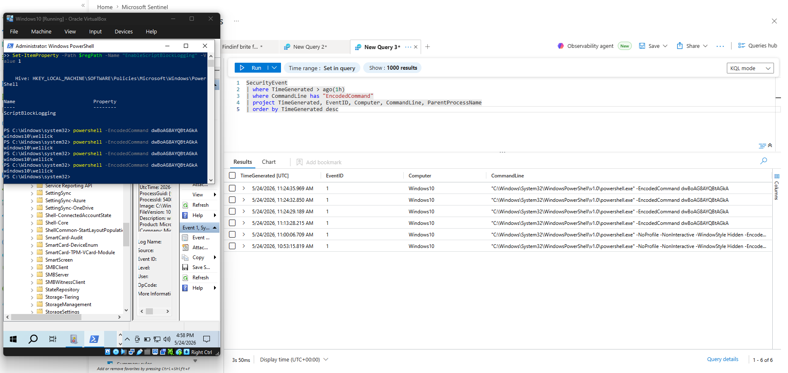
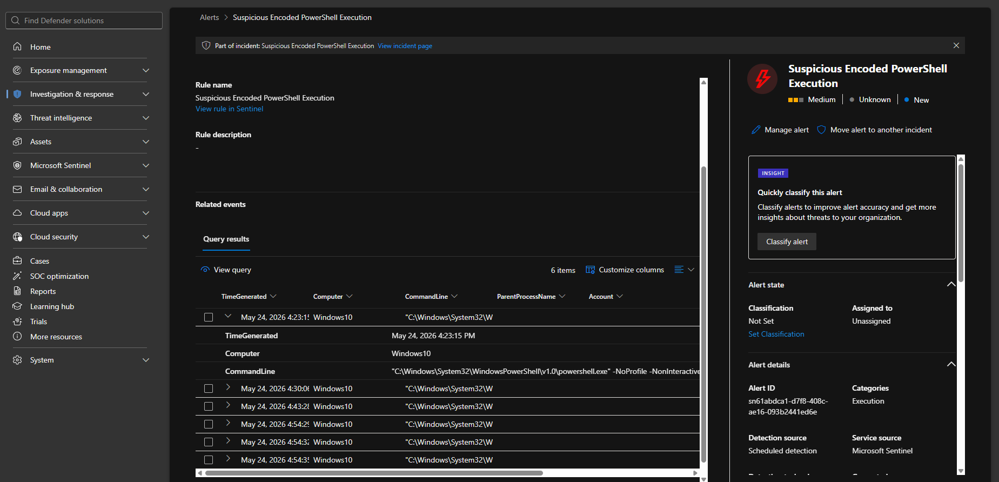

# IR-002 — Encoded PowerShell Execution
**Date:** 2026-05-24
**Severity:** Medium
**Status:** Resolved (Lab)

## What Happened
A Base64 encoded PowerShell command was executed on the Windows victim 
machine to simulate how malware hides its commands from basic string 
detection. The command ran silently in the background with no visible 
window.

## How It Was Detected
Sentinel Analytics Rule fired after detecting PowerShell launched with 
the -EncodedCommand flag via process creation logging (Windows native 
auditing + Sysmon).

## Attack Details
| Field | Value |
|-------|-------|
| MITRE Technique | T1059.001 |
| Tactic | Execution |
| Command Used | powershell -EncodedCommand dwBoAG8AYQBtAGkA |
| Decoded Command | whoami |
| Target Host | Windows VM |
| Process | powershell.exe |
| Parent Process | cmd.exe |

## Evidence

## What I Learned
Encoded PowerShell is extremely common in real malware. Detecting the 
flag itself (-EncodedCommand) is more reliable than trying to decode 
and match the payload, since the encoding changes every time but the 
flag stays the same.

## Recommended Response
1. Isolate the affected machine
2. Decode the Base64 command to understand intent
3. Check parent process — what launched PowerShell?
4. Review other process creation events around the same time
5. Scan machine for additional persistence mechanisms