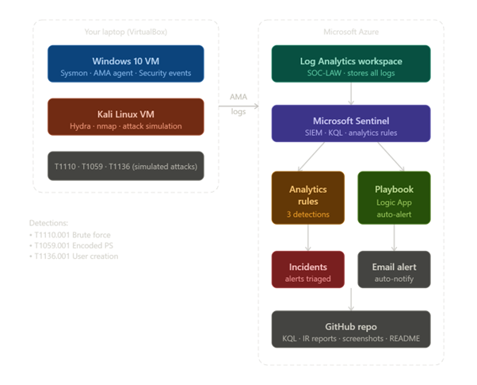

# Microsoft Sentinel SOC Home Lab

A personal home lab built to get hands-on with Microsoft Sentinel, 
KQL, and SOC workflows. Built alongside my SC-200 certification.

## What I Built
- Deployed Microsoft Sentinel on Azure with Log Analytics workspace
- Connected a Windows VM via Azure Monitor Agent and Sysmon
- Simulated common attacks using Kali Linux
- Wrote custom KQL detection rules mapped to MITRE ATT&CK
- Created Analytics Rules with automated alerting via Logic App playbook
- Documented findings as structured incident reports

## Architecture

## Detections Built

| Detection | MITRE Technique | Severity |
|-----------|----------------|----------|
| Brute Force - Failed Logins | T1110.001 | Medium |
| Encoded PowerShell Execution | T1059.001 | Medium |
| Suspicious User Account Created | T1136.001 | High |

## Tools Used
Microsoft Sentinel · Azure Log Analytics · KQL · 
Sysmon · Azure Monitor Agent · Kali Linux · Logic Apps

## Key Learnings
- How Windows native auditing and Sysmon complement each other
- Writing KQL aggregation queries to reduce alert noise
- How Sentinel Analytics Rules work (scheduling, entity mapping)
- Basics of SOAR through Logic App playbook automation
